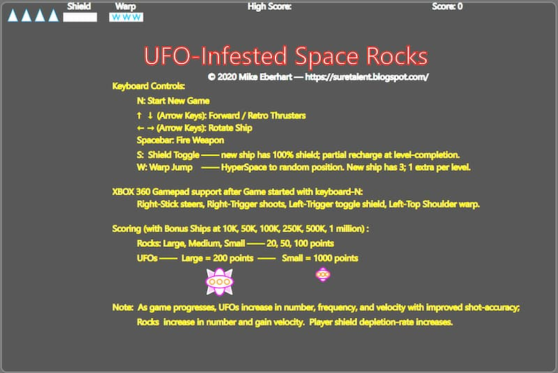

# UFO Infested Space Rocks
**UFO Infested Space Rocks** is an in-browser Asteroids style game using modern 2020+ JavaScript / ECMAScript and Browser features (async, classes, requestAnimationFrame, audioCtx, gamepad, etc.) with CSS-styled SVG UI. In the end, it is a clone of the famous 1979 Asteroids video game, but with various extra features and improvements I desired.

The game play evolves as you go, presenting "smarter" aliens and an ever more frenetic pace.  As the game progresses, UFOs increase in number, frequency, and velocity with improved shot-accuracy; Rocks increase in number and gain velocity.  Player shield depletion-rate increases. The alien ships will even take into account your movement as they vector their shots. But do not worry, your shield will start in a "raised" position at every ship respawn event in order to give you a fighting chance at surviving a bit longer, especially on advanced levels. Enjoy!

## Controls
The game uses either keyboard control or a gamepad. The intro-page for the game details the keyboard layout.


<br><br>

## Technology
I created this video-game clone in order to put some of the newest features of JS / ECMAScript to use, along with SVG styled and animated via CSS.

### JavaScript Features Used
* requestAnimationFrame / cancelAnimationFrame — which keeps the game frame-rate flowing fairly nicely even as many Space Rocks and UFOs are threatening your existence;
* Asynchronous code — async functions, await / Promise usage;
* JS Classes  — for encapsulation, inheritance, static variables and such;
* Game-pad support  — in addition to keyboard controls, I used the standard JS gamePad object to implement Xbox (or similar controller) support;
* Sound via audioCtx — without any extra files, but rather using audioCtx oscillator features; this not only kept things simple, but also removed the need for external sound-sample files or similar since all sounds are generated on-the-fly.
* localStorage - for high-score saving.

### CSS / SVG Features
* CSS styling of SVG elements;
* CSS Animation of fills, strokes, etc., used to bring life to the various UI elements; a LOT of interesting visual-effects were possible without the need to resort to a excessive custom animation code. 
* SVG ```<symbol>``` and ```<def>``` — to achieve maximum re-use via the SVG ```<use> ```element.
<br><br>

## Current Limitations
* Currently, **this only works on Google Chrome** (recommended) or **MS Edge Browser**.
* The UI was designed for use on a computer (vs. a phone), and currently lacks any type of responsive design UI to support smaller form factors. In fact, I have no idea how keyboard controls or game controller logic would make any sense on a mobile device, so this would likely involve implementing yet another input mechanism, which was beyond my scope.

In other words, the game works wonderfully in the modern Chrome browser on the PC.  But, there are numerous issues with it in Firefox, including: bullets do not display for either the player ship or enemy ships; ship collision with space rocks is not detected, the ship's shield does not display.  For now, the bottom line is that I spent a week writing this and did not invest further time to perfect it within Firefox or anything other than Chrome.  If you happen to fix any of these issues, please feel free to share.
<br><br>

## File Descriptions
The code is rather well commented and includes explanations for much of the core algorithms as well. There are also a few "TODO" notes pointing out where certain improvements or alterations may be interesting to implement. 

The files are:
* SpaceRocksSingle.html - **this is the game as a single-file HTML page** which can be downloaded and opened up locally in your browser. The other individual files in this repository have been simply combined within a single HTML file.
* SpaceRocks.svg - contains the SVG structure for the game. Various SVG elements are either hidden or displayed as needed during game initialization and gameplay.
* game.css - animation and styling of all the SVG is done via this CSS with the JS code performing the dynamic application of certain styles to game elements.
* game.js - all the game logic exists in this one file
* vec2d.js - a supporting file for 2D vector mathematics used in the game
